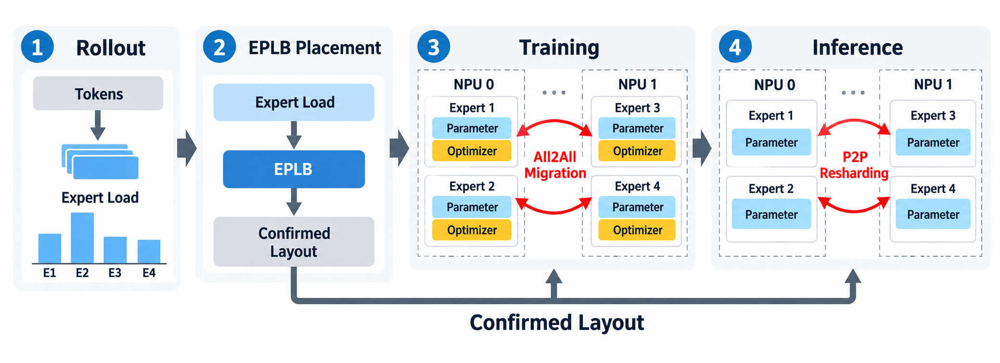
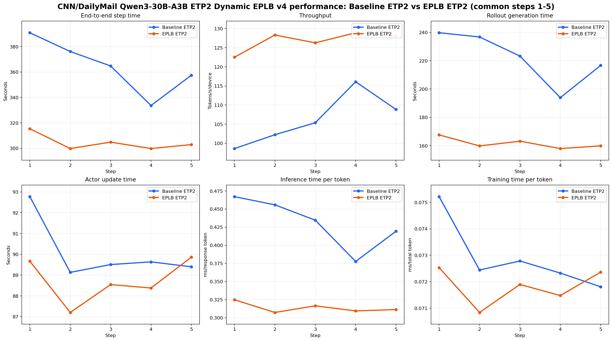
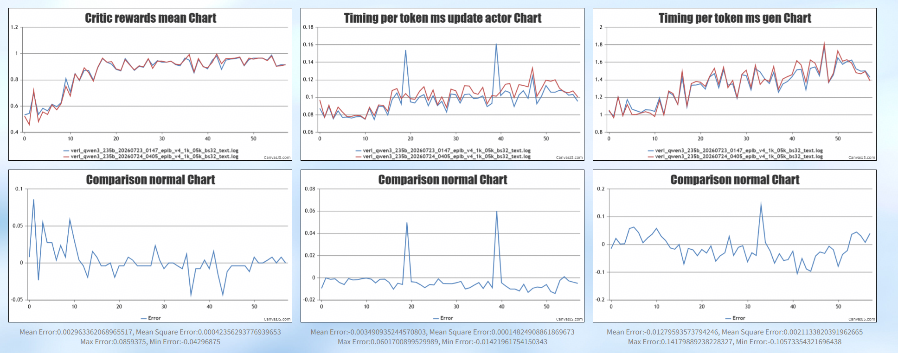
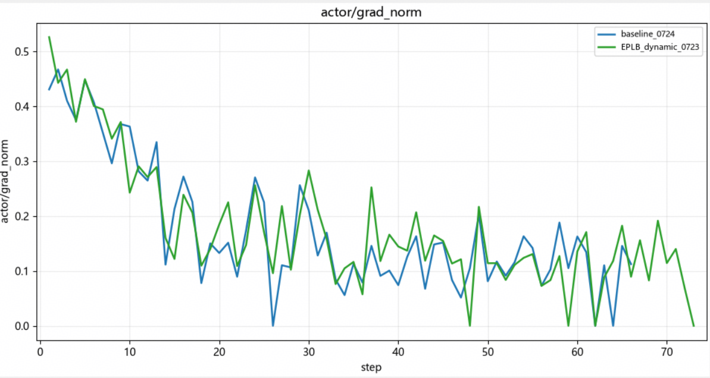

# EPLB recipe

面向 Ascend NPU 的 MoE 强化学习专家并行负载均衡方案。

MoE router 只把每个 token 分发给少数专家。专家热度不均且会随策略更新而变化，固定的专家放置会把这种不均衡放大为设备负载长尾：集合通信需要等待最慢的 rank。EPLB 根据实际路由负载重新计算“专家到设备”的放置。训练侧迁移专家权重和优化器状态，推理侧在发布权重时同步新的 expert map，从而保持训推布局一致。

## 架构

recipe 负责策略与训练编排，verl、MindSpeed 和 vLLM-Ascend 负责执行迁移及权重同步。



`RayEPLBTrainer` 继承 `RayPPOTrainer`，复用原生 worker 初始化、数据加载、验证、checkpoint、logprob、critic 和权重发布流程。固定版本的 `RayPPOTrainer` 没有每 step 扩展点，因此 recipe 只保留插入负载采集与迁移所需的 `fit()` 编排。继承的 `_validate()` 通过 checkpoint manager 适配器自动附带当前布局，不修改 `verl/trainer/ppo/ray_trainer.py`。

负载统计在 tensor 上完成 mask 过滤和 `torch.bincount` 聚合，只把最终的 `[num_layers, num_experts]` 计数矩阵传回 CPU。这样避免把完整路由张量转换为 Python list 并逐 token、逐层、逐 top-k 遍历。

### 动态重均衡流程

动态 EPLB 把一次更新拆为以下阶段，防止训练和推理使用不同布局：

1. **统计负载**：rollout 返回 `routed_experts`，trainer 只统计有效 token 的专家命中次数。
2. **生成策略**：每 `eplb_update_interval` 步根据累计负载生成新布局，并分配单调递增的版本号。
3. **等待执行**：在 old/ref logprob 完成后把候选布局交给训练后端；生成候选布局不代表迁移成功。
4. **执行迁移**：后端在 `train_mode` 中迁移专家权重和优化器状态，失败时直接抛错。
5. **确认并发布**：actor update 成功返回后才确认新版本，并在下一次权重同步时把相同布局发布给 rollout。

静态模式在 checkpoint 加载后、首次 rollout 权重发布前应用布局。critic warmup 期间不会把尚未确认的动态布局发布给 rollout。

### 运行模式

四种模式使用同一入口，通过 `mode=` 选择：

| 模式 | EPLB | 负载采集 | 用途 |
| --- | --- | --- | --- |
| `baseline` | 关闭 | 关闭 | 对照实验 |
| `collect` | 关闭 | 开启 | 导出负载画像，不迁移专家 |
| `static` | Static | 关闭 | 使用预先生成的固定布局 |
| `dynamic` | Dynamic | 自动开启 | 周期性统计负载并更新布局 |

四种模式默认都启用 R3 routing replay，避免 A/B 实验同时改变路由采集条件。若 baseline 需要完全关闭路由返回，应同时关闭 rollout routing replay，并把这部分开销单独报告。缺少 `routed_experts` 时，`collect` 和 `dynamic` 会直接失败。

## 性能实验

### 实验配置

性能实验使用 Qwen3-30B-A3B BF16 和 CNN/DailyMail 3.0.0，在 2 节点、每节点 16 张 Ascend NPU 上运行。训练并行为 TP2、EP16、ETP2、PP1，rollout 为 TP1、EP16、DP16；`train_batch_size=32`、`rollout.n=16`、最大 prompt/response 长度为 1536/1024。Baseline 与 Dynamic EPLB 的模型、数据顺序和主要配置一致，actor 学习率设为 0，以隔离性能差异。

日志覆盖共同的 step 1-5。EPLB 在第一个训练 step 前应用 version 1 布局，更新间隔为 10，因此本实验验证的是初始布局收益，不包含第 10 步后的动态策略更新和迁移成本。

### 实验结果



共同的 5 个 step 中，Dynamic EPLB 的平均 step 时间由 364.580 s 降至 304.548 s，下降 16.47%；吞吐由 106.222 提升至 126.815 tokens/s/device，提升 19.39%。主要收益来自 rollout：平均生成时间下降 27.20%，单 response token 推理时间下降 27.17%。训练侧 update actor 时间下降 1.51%，单 token 训练时间下降 1.50%。5 个 step 的端到端时间和推理吞吐均优于 Baseline。

排除首步后，step 2-5 的平均 step 时间下降 15.69%，吞吐提升 18.28%，单 token 推理时间下降 26.26%。Dynamic EPLB 的负载采集平均耗时 1.862 s，占 EPLB step 时间的 0.62%，已经计入端到端结果。

两组实验的 prompt 完全一致。共同区间内平均总 token 相差 -0.011%，平均 response 长度相差 -0.027%；稳态区间的总 token 差异为 -0.072%。单 token 指标也消除了生成长度影响，因此本次加速不是通过减少工作量获得的。rollout gen 的变异系数由 7.41% 降至 2.11%，未观察到额外设备内存占用。

## 精度与长稳实验

另一组实验使用相同模型规模和 32 张 NPU，对比 66 个共同训练 step。训练并行为 TP2、EP16、ETP1，rollout 为 DP16、TP1、EP16，`rollout.n=8`、最大 response 长度为 2048、学习率为 `1e-6`。Dynamic EPLB 在 step 20、40、60 更新布局。





Dynamic EPLB 与 Baseline 的 reward 均值分别为 0.87317 和 0.87068，两条曲线正常上升，领先关系在不同区间交替，动态迁移后的 step 没有出现精度突变。两组 rollout/actor Pearson correlation 分别为 0.997867 和 0.997803，rollout correction KL 分别为 0.000671 和 0.000637；PPL、clipfrac、梯度范数和 aborted ratio 也未显示异常。实验结果表明 EPLB 保持了与 Baseline 一致的精度趋势和训练稳定性。

这组长稳实验基于早期的负载统计实现：它会把完整路由张量 `.cpu().tolist()`，再用 Python 循环逐项计数，产生约 52.3 s/step 的额外 CPU 开销。当前 recipe 已改为 tensor 聚合，只将最终计数矩阵转到 CPU，因此该实验中的端到端性能差异不能代表当前实现；其 reward、训推一致性和多次动态迁移结果仍可作为精度与稳定性旁证。

## 依赖版本

[REQUIRED_VERL.txt](REQUIRED_VERL.txt) 记录了 verl、MindSpeed、Megatron-LM 和 vLLM-Ascend 的固定版本，以及所附补丁的 SHA256。

| 组件 | 基线版本 | 补丁 | 作用 |
| --- | --- | --- | --- |
| verl | `5a38699c` | `patches/verl-eplb-core.patch` | worker RPC、迁移调用和权重同步接口 |
| MindSpeed | `96e402f0` | `patches/mindspeed-eplb.patch` | 执行专家权重及优化器状态迁移 |
| Megatron-LM | `ddc0d677` | `patches/megatron-lm-eplb.patch` | 拆分专家梯度 bucket，降低迁移临时缓冲需求 |
| vLLM-Ascend | `e21b5fca` | 无 | 直接使用原生实现 |
| CANN | `25.5.2` | 无 | Ascend toolkit 与算子运行时 |
| PyTorch | `2.9.0` | 无 | 训练基础框架 |
| torch_npu | `2.9.0.post2` | 无 | PyTorch Ascend 适配 |

以上环境版本来自完成 2 节点验证的 `verl_eplb:v2_0828` 容器。该容器同时使用 vLLM `0.18.1.dev0+gbcf2be961`、vLLM-Ascend `0.18.1.dev26+ge21b5fca0`、Ray `2.57.0` 和 mbridge `0.15.1`。

## 安装

```bash
git clone https://github.com/verl-project/verl.git
cd verl
git checkout 5a38699c0fbd99a249098b1d579817c8a8cfb8cd
git submodule update --init --recursive recipe
VERL_SOURCE=. bash recipe/eplb/scripts/setup_verl.sh
```

`setup_verl.sh` 校验 verl commit，幂等应用 EPLB core patch，并使用 `uv pip install --no-deps` 安装，避免替换已有的 torch、torch_npu 和 CANN 环境。设置 `SKIP_INSTALL=1` 可以只应用补丁。

仅拉取固定 commit 时可以使用浅 fetch：

```bash
mkdir verl && cd verl && git init -q .
git remote add origin https://github.com/verl-project/verl.git
git fetch --depth 1 origin 5a38699c0fbd99a249098b1d579817c8a8cfb8cd
git checkout FETCH_HEAD
```

recipe 子模块需要能获取目标 gitlink；不要直接使用 `git submodule update --depth 1` 假设默认分支 tip 包含该 revision。多节点运行时，每个节点必须使用相同的 recipe、verl 和策略文件路径。

## 使用方法

```bash
export MODEL_PATH=/models/your-moe-model
export TRAIN_FILES=/data/train.parquet
export VAL_FILES=/data/val.parquet
export NNODES=1 NPUS_PER_NODE=8 TRAIN_EP=8 ROLLOUT_TP=8 ROLLOUT_EP=8

# Baseline
bash recipe/eplb/scripts/run.sh baseline trainer.total_training_steps=10

# 采集负载
bash recipe/eplb/scripts/run.sh collect \
  trainer.eplb_load_collection_steps=10 trainer.total_training_steps=10 \
  trainer.eplb_load_output_path=./outputs/eplb/load.json

# 根据同一负载画像生成训练和推理布局
python3 -m recipe.eplb.generate_strategy \
  --load ./outputs/eplb/load.json --output ./outputs/eplb/train.json --ep "$TRAIN_EP"
python3 -m recipe.eplb.generate_strategy \
  --load ./outputs/eplb/load.json --output ./outputs/eplb/rollout.json --ep "$ROLLOUT_EP"

# Static EPLB
export TRAIN_STRATEGY="$PWD/outputs/eplb/train.json"
export ROLLOUT_STRATEGY="$PWD/outputs/eplb/rollout.json"
bash recipe/eplb/scripts/run.sh static trainer.total_training_steps=10

# Dynamic EPLB
unset ROLLOUT_STRATEGY
bash recipe/eplb/scripts/run.sh dynamic \
  trainer.eplb_update_interval=2 trainer.total_training_steps=10
```

`run.sh` 的默认 batch、rollout 数量和并行配置只用于提供统一入口，不是性能推荐。请根据模型规模、TP、PP、EP 和设备内存在命令末尾追加 Hydra override。自定义策略函数签名为 `eplb_strategy(history_loads, eplb_config)`，通过 `actor_rollout_ref.rollout.eplb_strategy_file_path` 指定。

## 使用边界

- 训练侧要求非冗余布局：每个专家只出现一次，每个 EP rank 的专家容量相同。
- 训练依赖 distributed optimizer；MindSpeed 的其他限制由后端配置检查。
- 训练 EP 与 rollout EP 不同时，静态模式需要分别生成匹配的布局文件。
- EPLB 尚不支持从 checkpoint 恢复专家布局，启用 EPLB 时应使用 `trainer.resume_mode=disable`。
- 不要同时启用另一套推理侧动态 EPLB 控制器，以免两个控制器竞争 expert map。

## 测试

recipe 包含 51 项 CPU 测试，覆盖四种模式的 Hydra 配置、入口选择、TaskRunner 装配、初始化顺序、tensor 化负载统计、动态迁移确认和失败路径、负载导出、不同 EP 的离线策略生成，以及 rollout 专家权重重排。

```bash
uv pip install --python python3 -r recipe/eplb/requirements-test.txt
python3 -m pytest recipe/eplb/tests -q
ruff check recipe/eplb
ruff format --check recipe/eplb
```
